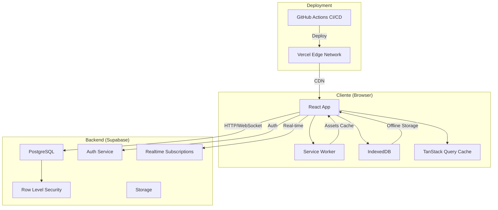
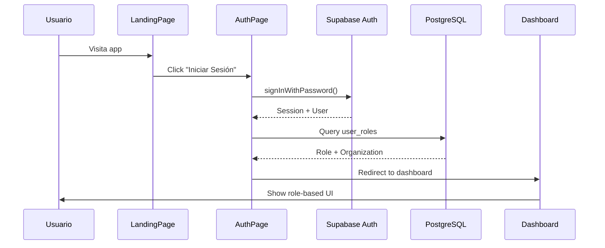

# Arquitectura de MediVisitPro

Este documento describe la arquitectura técnica de MediVisitPro, un sistema de gestión para representantes médicos.

---

## 📐 Visión General

MediVisitPro es una aplicación web progresiva (PWA) offline-first construida con React y TypeScript, respaldada por Supabase como Backend-as-a-Service.



---

## 🏗️ Capas de la Aplicación

### 1. Capa de Presentación (UI)

**Tecnologías**: React 18, shadcn/ui, Radix UI, Tailwind CSS

**Responsabilidades**:

- Renderizado de interfaz de usuario
- Manejo de interacciones del usuario
- Validación de formularios del lado del cliente
- Navegación entre vistas

**Estructura**:

```
src/components/
├── ui/             # Componentes base (buttons, inputs, etc.)
├── layout/         # Layout components (Sidebar, Header)
├── auth/           # Authentication components
├── forms/          # Form components (dialogs, inputs)
└── [feature]/      # Feature-specific components
```

**Patrones**:

- **Atomic Design**: Componentes organizados de menor a mayor complejidad
- **Composition**: Uso intensivo de component composition
- **Render Props** y **Hooks** para lógica reutilizable

---

### 2. Capa de Lógica de Negocio

**Tecnologías**: Custom Hooks, TanStack Query, Zod

**Responsabilidades**:

- Lógica de negocio de la aplicación
- Gestión de estado global y local
- Cacheo y sincronización de datos
- Validación de datos

**Hooks Principales**:

```typescript
// Authentication & Authorization
useAuth()              // User, session, roles, permissions
useOrganization()      // Current organization context

// Business Logic
useDoctorScoring()     // Doctor scoring algorithm
useSampleDistribution() // Sample inventory management
useWorkProcesses()     // Business process workflows
useInventoryAlerts()   // Stock alert notifications

// Data Fetching (via TanStack Query)
useQuery(['visits'])   // Fetch visits
useMutation(...)       // Create/Update/Delete operations
```

**Validación con Zod**:

```typescript
const visitsSchema = z.object({
  doctor_id: z.string().uuid(),
  visit_date: z.date(),
  notes: z.string().min(10)
});
```

---

### 3. Capa de Datos y Estado

**Tecnologías**: TanStack Query, React Context, IndexedDB

#### 3.1 Gestión de Estado Global

**AuthContext** (via AuthProvider):

```typescript
interface AuthContextType {
  user: User | null;
  role: UserRole;
  permissions: string[];
  isAuthenticated: boolean;
  // ... 20+ derived flags
}
```

**OrganizationContext**:

```typescript
interface OrganizationContextType {
  selectedOrganization: Organization | null;
  setOrganization: (org: Organization) => void;
  // Multi-tenant context
}
```

#### 3.2 Server State (TanStack Query)

```typescript
// Configuración global en App.tsx
const queryClient = new QueryClient({
  defaultOptions: {
    queries: {
      staleTime: 1000 * 60 * 5,    // 5 min
      gcTime: 1000 * 60 * 60 * 24, // 24 hrs (offline)
      retry: 2
    }
  }
});
```

**Estrategia de Caching**:

- NetworkFirst para datos critical (visitas, contacts)
- CacheFirst para datos estáticos (products, specialties)
- Invalidación optimista para mutaciones

#### 3.3 Offline Storage (IndexedDB)

```typescript
// Via idb library
import { openDB } from 'idb';

const db = await openDB('medivisitpro', 1, {
  upgrade(db) {
    db.createObjectStore('visits');
    db.createObjectStore('contacts');
    db.createObjectStore('samples');
  }
});
```

**Almacenamiento offline**:

- Visitas pendientes de sincronizar
- Contactos frecuentes
- Stock de muestras actual
- Imágenes y archivos adjuntos

---

### 4. Capa de Comunicación (API)

**Tecnologías**: Supabase Client, HTTP, WebSockets

#### 4.1 Supabase Client

```typescript
// src/integrations/supabase/client.ts
import { createClient } from '@supabase/supabase-js';

export const supabase = createClient(
  process.env.VITE_SUPABASE_URL,
  process.env.VITE_SUPABASE_ANON_KEY
);
```

#### 4.2 Operaciones CRUD

```typescript
// Read
const { data, error } = await supabase
  .from('visits')
  .select('*, contacts(*), products(*)')
  .eq('user_id', userId);

// Create
const { data, error } = await supabase
  .from('visits')
  .insert({ ... });

// Update
const { data, error } = await supabase
  .from('visits')
  .update({ status: 'completed' })
  .eq('id', visitId);

// Delete
const { data, error } = await supabase
  .from('visits')
  .delete()
  .eq('id', visitId);
```

#### 4.3 Real-time Subscriptions

```typescript
const subscription = supabase
  .channel('visits_channel')
  .on('postgres_changes', {
    event: 'INSERT',
    schema: 'public',
    table: 'visits'
  }, payload => {
    // Handle new visit
  })
  .subscribe();
```

---

## 🔐 Sistema de Autenticación y Autorización

### Flujo de Autenticación



### Sistema RBAC (Role-Based Access Control)

**12 Roles Soportados**:

```
master           # Acceso total, todas las organizaciones
├── admin        # Administrador de organización
    ├── manager  # Gerente de área
        ├── chief         # Jefe de línea
            ├── coordinator   # Coordinador de zona
                ├── supervisor    # Supervisor de equipo
                    ├── telemarketing    # Telemarketing
                    └── representative   # Representante médico

# Roles especializados (paralelos)
- doctor          # Médico
- pharmacist      # Farmacéutico
- service_chief   # Jefe de servicio
- store_manager   # Gerente de almacén
```

**Jerarquía de Permisos**:

```typescript
// Un admin PUEDE todo lo que puede un manager
const isAdmin = role === 'master' || role === 'admin';
const isManager = isAdmin || role === 'manager';
const isChief = isManager || role === 'chief';
// ... etc.
```

**Permisos Granulares**:

```typescript
interface Permissions {
  // User Management
  canManageUsers: boolean;        // master, admin
  canViewAllData: boolean;        // master, admin, manager
  
  // Finance
  canApproveExpenses: boolean;    // manager+
  canManageBilling: boolean;      // master
  
  // Operations
  canManageProducts: boolean;     // manager+
  canManageSamples: boolean;      // manager+, pharmacist
  canManageZones: boolean;        // master, admin
  
  // Specialized
  canViewMedicalInfo: boolean;    // supervisor+, doctor
  canManageService: boolean;      // service_chief, manager+
}
```

**Feature Flags por Organización**:

```typescript
interface OrganizationSettings {
  features: {
    sales_module: boolean;           // Default: true
    warehouse_module: boolean;       // Default: false
    telemarketing_module: boolean;   // Default:false
    events_module: boolean;          // Default: false
  }
}

// En AuthProvider
canUseSales: isMaster || features.sales_module !== false
canUseWarehouse: isMaster || features.warehouse_module === true
```

---

## 🗄️ Modelo de Base de Datos

### Esquema Multi-Tenant

```sql
-- Organizaciones (Tenants)
CREATE TABLE organizations (
  id UUID PRIMARY KEY DEFAULT uuid_generate_v4(),
  name TEXT NOT NULL,
  settings JSONB DEFAULT '{}',
  created_at TIMESTAMPTZ DEFAULT NOW()
);

-- Perfiles de Usuario
CREATE TABLE profiles (
  id UUID PRIMARY KEY REFERENCES auth.users,
  email TEXT NOT NULL,
  full_name TEXT,
  organization_id UUID REFERENCES organizations,
  created_at TIMESTAMPTZ DEFAULT NOW()
);

-- Roles de Usuario (RBAC)
CREATE TABLE user_roles (
  id UUID PRIMARY KEY DEFAULT uuid_generate_v4(),
  user_id UUID REFERENCES auth.users,
  organization_id UUID REFERENCES organizations,
  role TEXT NOT NULL,  -- 'admin', 'manager', etc.
  zone_id UUID REFERENCES zones,
  state TEXT,
  region TEXT,
  UNIQUE(user_id, organization_id)
);

-- Contactos (Médicos, Farmacias, etc.)
CREATE TABLE contacts (
  id UUID PRIMARY KEY DEFAULT uuid_generate_v4(),
  organization_id UUID REFERENCES organizations,
  type TEXT NOT NULL,  -- 'doctor', 'pharmacy', etc.
  name TEXT NOT NULL,
  specialties TEXT[],
  location GEOGRAPHY(POINT),
  -- ... más campos
  created_at TIMESTAMPTZ DEFAULT NOW()
);

-- Visitas
CREATE TABLE visits (
  id UUID PRIMARY KEY DEFAULT uuid_generate_v4(),
  organization_id UUID REFERENCES organizations,
  user_id UUID REFERENCES auth.users,
  contact_id UUID REFERENCES contacts,
  visit_date TIMESTAMPTZ NOT NULL,
  status TEXT DEFAULT 'planned',
  notes TEXT,
  signature_url TEXT,
  -- ... más campos
  created_at TIMESTAMPTZ DEFAULT NOW()
);
```

### Row Level Security (RLS)

**Políticas de Aislamiento Multi-Tenant**:

```sql
-- Ejemplo: contacts table
CREATE POLICY "Users can only see contacts from their organization"
  ON contacts
  FOR SELECT
  USING (
    organization_id IN (
      SELECT organization_id 
      FROM user_roles 
      WHERE user_id = auth.uid()
    )
  );

-- Master bypass
CREATE POLICY "Master users can see all contacts"
  ON contacts
  FOR ALL
  USING (
    EXISTS (
      SELECT 1 FROM user_roles
      WHERE user_id = auth.uid()
      AND role = 'master'
    )
  );
```

**Políticas por Rol**:

```sql
-- Solo managers pueden crear productos
CREATE POLICY "Only managers can create products"
  ON products
  FOR INSERT
  WITH CHECK (
    EXISTS (
      SELECT 1 FROM user_roles
      WHERE user_id = auth.uid()
      AND role IN ('master', 'admin', 'manager')
    )
  );
```

---

## 🔄 Arquitectura Offline-First

### Service Worker (PWA)

```javascript
// vite.config.ts - PWA config
VitePWA({
  workbox: {
    runtimeCaching: [
      {
        urlPattern: /^https:\/\/.*supabase\.co\/.*$/,
        handler: 'NetworkFirst',
        options: {
          cacheName: 'supabase-api-cache',
          expiration: {
            maxEntries: 500,
            maxAgeSeconds: 60 * 60 * 24 * 7  // 7 days
          }
        }
      }
    ]
  }
})
```

### Sincronización Offline

```typescript
// useOfflineSync hook
export function useOfflineSync() {
  const syncQueue = useRef<QueueItem[]>([]);
  
  const addToQueue = (action: Action) => {
    syncQueue.current.push(action);
    saveToIndexedDB(syncQueue.current);
  };
  
  const syncAll = async () => {
    for (const item of syncQueue.current) {
      try {
        await executeAction(item);
        removeFromQueue(item.id);
      } catch (error) {
        // Retry logic
      }
    }
  };
  
  useEffect(() => {
    window.addEventListener('online', syncAll);
    return () => window.removeEventListener('online', syncAll);
  }, []);
}
```

---

## 🚀 Deployment y CI/CD

### Vercel Deployment

```json
// vercel.json
{
  "headers": [{
    "source": "/(.*)",
    "headers": [{
      "key": "Content-Security-Policy",
      "value": "default-src 'self'; ..."
    }]
  }],
  "rewrites": [{
    "source": "/(.*)",
    "destination": "/index.html"  // SPA routing
  }]
}
```

### GitHub Actions

```yaml
# .github/workflows/deploy.yml
name: Deploy to Supabase
on:
  push:
    branches: [master]
    
jobs:
  deploy:
    runs-on: ubuntu-latest
    steps:
      - uses: actions/checkout@v4
      - uses: supabase/setup-cli@v1
      - run: supabase db push
```

---

## 📊 Consideraciones de Performance

### Bundle Size Optimization

- **Code Splitting**: Lazy loading de rutas
- **Tree Shaking**: Eliminación de código no usado
- **Dynamic Imports**: Carga bajo demanda

```typescript
// Lazy loading de páginas pesadas
const Pharmacies = lazy(() => import('./pages/Pharmacies'));
const Dashboard Master = lazy(() => import('./pages/DashboardMaster'));
```

### Database Query Optimization

- **Índices**: En columnas frecuentemente consultadas
- **Paginación**: Límites en queries grandes
- **Select optimizado**: Solo campos necesarios

```typescript
// ✅ CORRECTO
const { data } = await supabase
  .from('visits')
  .select('id, visit_date, contact:contacts(name)')
  .limit(50);

// ❌ INCORRECTO (fetch todo)
const { data } = await supabase
  .from('visits')
  .select('*')  // Trae todos los campos
```

---

## 🔒 Seguridad

### Principios

1. **Defense in Depth**: Múltiples capas de seguridad
2. **Least Privilege**: Mínimos permisos necesarios
3. **Zero Trust**: Verificar siempre, nunca confiar

### Implementaciones

- **RLS en PostgreSQL**: Aislamiento de datos
- **JWT Validation**: Tokens firmados por Supabase
- **CSP Headers**: Content Security Policy
- **HTTPS Only**: Forzado en producción
- **Environment Variables**: Secretos nunca en código

---

## 📈 Escalabilidad

### Horizontal Scaling

- **Supabase**: Auto-scaling de PostgreSQL
- **Vercel**: Edge network global
- **CDN**: Assets estáticos cacheados

### Vertical Scaling

- **Índices de BD**: Queries más rápidas
- **Connection Pooling**: Supabase Pooler
- **Caching agresivo**: TanStack Query + SW

---

## 🛠️ Herramientas de Desarrollo

- **VS Code**: Editor recomendado
- **React DevTools**: Debugging de componentes
- **TanStack Query DevTools**: Inspección de queries
- **Supabase Studio**: Gestión de BD
- **Vercel Analytics**: Métricas de performance

---

**Última actualización**: 2026-01-16
