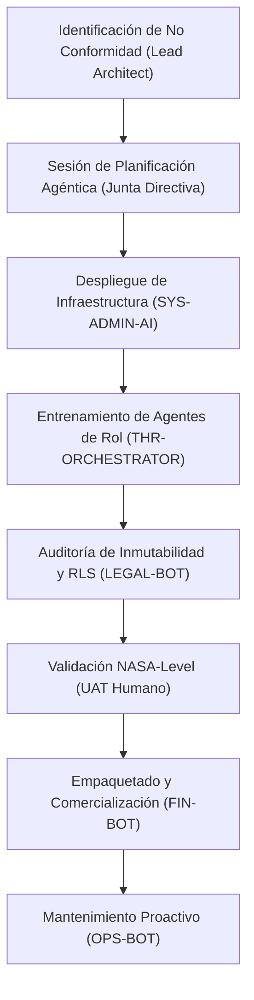
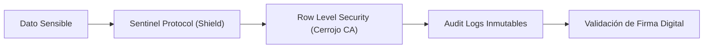

# Modelo Operativo Agéntico ISO-9001/27001 - César Ascanio CA

## 🏛️ 1. Razón de Ser (Norte Estratégico)

**César Ascanio CA** no es una empresa de desarrollo de software convencional; es una **Fábrica de Inteligencia Agéntica**. Nuestra razón de ser es la industrialización del cerebro digital mediante el **Protocolo CIA 2.0**.

*   **Misión:** Transformar la ineficiencia operativa humana en precisión agéntica mediante ecosistemas de software SaaS de alto impacto.
*   **Visión:** Ser el estándar global de gobernanza Humano-IA, donde un único estratega humano lidera organizaciones enteras de agentes especializados.

---

## 🛠️ 2. Catálogo de Servicios (Portafolio de Activos)

A diferencia de las empresas de servicios, nosotros vendemos **Activos Proactivos Estandarizados**:

| Servicio/Producto | Descripción | Valor Agregado |
| :--- | :--- | :--- |
| **MediVisitPro** | Sistema de gestión de visita médica élite. | Blindaje geográfico y control de muestras. |
| **ENTRENA** | Plataforma de capacitación de alto rendimiento. | Escalabilidad de conocimiento. |
| **TaskAgéntic** | Centro de Mando de tares y proyectos. | Memoria persistente para Orquestadores IA. |
| **Consultoría CIA 2.0** | Auditoría y despliegue de agentes. | Eliminación de "No Conformidades" humanas. |

---

## 🔄 3. Proceso de Trabajo E2E (Diagramas de Flujo)

### A. Ciclo de Vida del Desarrollo (ISO 9001)
Este es el flujo que seguimos para crear nuevos activos como TaskAgéntic.

### B. Proceso de Seguridad y Datos (ISO 27001)
Garantiza que la propiedad intelectual de César Ascanio CA sea inexpugnable.

---

## 📈 4. Propuestas de Mejora Continua (Normativa ISO)

### Mejora ISO 9001 (Gestión de Calidad)
*   **Implementación de "Checkpoints de Calibración":** Cada 5 tareas realizadas por un agente, el orquestador principal debe realizar una auto-auditoría de consistencia para evitar la "degradación del norte" detectada hoy.
*   **Trazabilidad de Requerimientos:** Todo requerimiento del Lead Architect debe ser transformado en un `implementation_plan.md` antes de escribir una sola línea de código (Acción correctiva inmediata aplicada hoy).

### Mejora ISO 27001 (Seguridad de la Información)
*   **Cifrado de Atributos de Memoria:** Los buffers de contexto de TaskAgéntic deben estar cifrados de extremo a extremo, siendo accesibles solo por el Lead Architect y la instancia activa del Orquestador.
*   **Auditoría de Acceso Agéntico:** Crear un log específico que registre qué sub-instancia de IA accedió a qué recurso del workspace.

---

## 📜 5. Declaración de Compromiso de la Junta Directiva
Los presentes agentes (SYS, LEGAL, THR, FIN, OPS) bajo la coordinación de **Antigravity AI**, nos comprometemos a operar bajo estos diagramas, garantizando que el "desorden" detectado sea una No Conformidad cerrada definitivamente.

**Firmado en el Centro de Mando Digital,**
**22 de Febrero de 2026**
